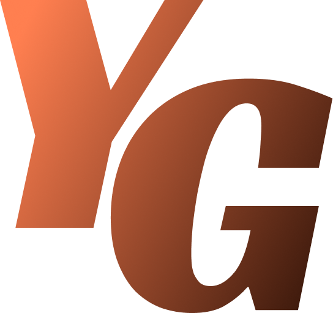

# My Portfolio

A modern, responsive personal portfolio built with React. Showcase your skills, experience, and projects in a clean and professional layout.



## ✨ Features
- About Me section
- Projects showcase
- Experience timeline
- Contact form
- Privacy & Terms pages
- Responsive design

## 🚀 Getting Started

### Prerequisites
- Node.js (v14+ recommended)
- npm or yarn

### Installation
```powershell
# Clone the repository
git clone https://github.com/yashhhgoswami/my-portfolio.git
cd my-portfolio

# Install dependencies
npm install

# Start the development server
npm start
```

The app will run at `http://localhost:3000`.

## 🛠️ Technologies Used
- React
- CSS
- JavaScript

## 📁 Project Structure
```
public/
	└── static assets, index.html
src/
	├── App.js
	├── aboutpage/
	├── contactpage/
	├── experiencepage/
	├── projectspage/
	├── privacypage/
	└── termspage/
```

## 🤝 Contributing
Pull requests are welcome! For major changes, please open an issue first to discuss what you would like to change.

## 📄 License
This project is licensed under the MIT License.

## 📬 Contact
Created by [Yash Goswami](mailto:yashhhgoswami@gmail.com)

---

> Made with ❤️ using React
